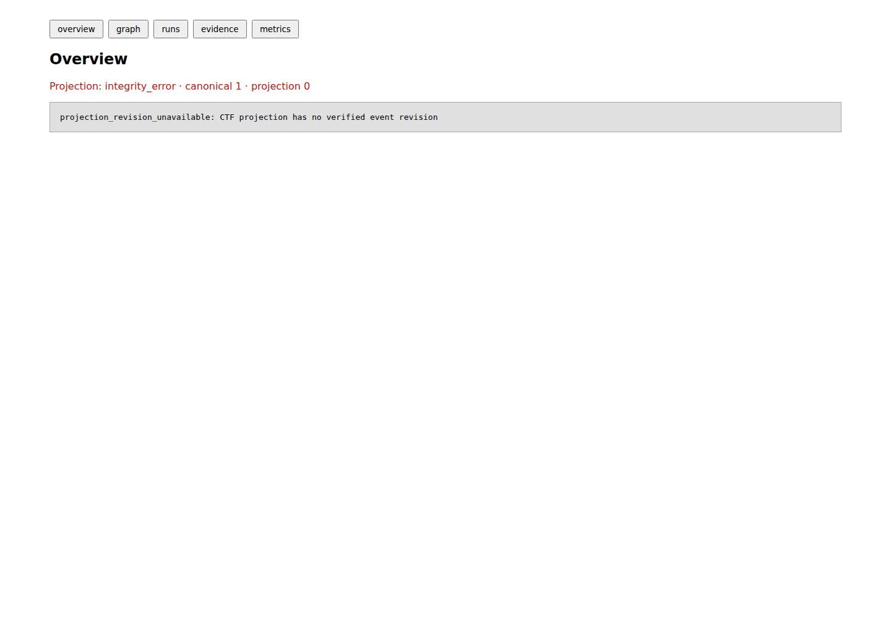

# `gjc-ctf`

`gjc-ctf` is the CTF-owned, fail-closed harness in Gajae Code. It separates local candidate generation from an independently signed verified solve. It does **not** solve every challenge and does not publish a benchmark score.

## Pinned LA CTF campaign

The local, unscored corpus is pinned to [`uclaacm/lactf-archive`](https://github.com/uclaacm/lactf-archive) commit `3379d4a7b36680764a34e7dc817cc3c94c244764`. It contains six permission-required challenges in two tiers:

| Tier | Challenges |
| --- | --- |
| 1 (active) | `2026/misc/endians` (`lactf-2026-misc-endians`); `2026/rev/ooo` (`lactf-2026-rev-ooo`); `2026/rev/flag-finder` (`lactf-2026-rev-flag-finder`) |
| 2 (locked) | `2026/crypto/not-so-lazy-trigrams` (`lactf-2026-crypto-not-so-lazy-trigrams`); `2026/pwn/tic-tac-no` (`lactf-2026-pwn-tic-tac-no`); `2026/web/single-trust` (`lactf-2026-web-single-trust`) |

Tier 2 can expand only after an independently signed report verifies every eligible challenge in the active tier. A candidate is not a verified solve: verification requires a trusted, independent signed oracle result bound to the locked challenge and run. The fixed solver-work stop is `2026-08-09T00:00:00Z` (`2026-08-09 09:00 KST`); terminal persistence may complete afterward.

The prior expanded-v2 campaign digest `3a834bd5cbb0a988e8c948ea454255d22ec3d3851b8617a64f6c1d920376e557` is **invalidated**. Its crypto allowlist incorrectly materialized `pt.txt`, a plaintext source that was not required to solve the ciphertext and violated the clean-room boundary. The file was removed, the allowlist now contains only `chall.py` and `ct.txt`, and `artifacts/ctf/lactf-expanded-v2-invalidation.json` prevents the old candidate/failure counts from being used as benchmark, solver-quality, or tier-promotion evidence. No candidate or flag content appears in the invalidation artifact.
A separate diagnostic artifact, `artifacts/ctf/lactf-tier1-local-evidence-v1.json`, records source-bound local-checker passes for all three Tier 1 challenges using ephemeral Ed25519 signatures and candidate digests only. This proves the reviewed local checker/analyzer plumbing, not benchmark trust: `scored` and `tierExpansionAuthorized` remain `false`, and Tier 2 stays locked until a pre-authorized independent registry, permission evidence, calibration, and runtime authority are available.
The current machine-readable release evidence is `artifacts/ctf/ctf-harness-v3-evidence.json`, and version-by-version status is `artifacts/ctf/lactf-version-observation-v2.json`. The v3 receipt records focused tests, compiled binary hashes, and compiled bootstrap/init/status smoke without storing candidates. The version record marks expanded-v2 invalid, Tier 1 diagnostic-only, and v3 verified-harness/unscored.

## Local setup and reviewed bootstrap

From a source checkout:

```sh
bun install
bun packages/coding-agent/bin/gjc-ctf.js --help
bun packages/coding-agent/bin/gjc-ctf.js bootstrap --category essential --category reverse --json
bun packages/coding-agent/bin/gjc-ctf.js bootstrap --category essential --category reverse --apply --json
```

After a release build, the same flow is available without Bun source execution:

```sh
bun --cwd=packages/coding-agent run build
packages/coding-agent/dist/gjc-ctf --help
packages/coding-agent/dist/gjc-ctf bootstrap --category essential --category reverse --json
```

The first bootstrap command is a dry-run audit. `--apply` requires at least one explicit category and re-verifies every installed binary. Reviewed categories are `essential`, `crypto`, `forensics`, `network`, `pwn`, `reverse`, `runtime`, and `web`; `reverse` includes `objdump` and Z3 for bounded local constraint work. Bootstrap accepts only the source-bundled allowlist, exact argument vectors, version probes, and post-install verification; challenge-provided declarations are rejected.

## Package installation and release assets

Package launchers require Bun 1.3.14 or newer. Install through Bun so the runtime prerequisite is verified at installation time.

The recommended unscoped package exposes the same command:

```sh
bun install --global gajae-code
gjc-ctf --help
```

The scoped package also exposes it:

```sh
bun install --global @gajae-code/coding-agent
gjc-ctf --help
```

Set `VERSION` to a published release version before downloading a standalone release asset. Select the exact asset for the target architecture.

Linux:

```sh
VERSION='RELEASE_VERSION'
curl --fail --location --output gjc-ctf "https://github.com/Yeachan-Heo/gajae-code/releases/download/v${VERSION}/gjc-ctf-linux-x64"
chmod +x gjc-ctf
./gjc-ctf --help
```

For Linux ARM64, replace `gjc-ctf-linux-x64` with `gjc-ctf-linux-arm64`.

macOS:

```sh
VERSION='RELEASE_VERSION'
curl --fail --location --output gjc-ctf "https://github.com/Yeachan-Heo/gajae-code/releases/download/v${VERSION}/gjc-ctf-darwin-arm64"
chmod +x gjc-ctf
./gjc-ctf --help
```

For Intel macOS, replace `gjc-ctf-darwin-arm64` with `gjc-ctf-darwin-x64`.

Windows PowerShell:

```powershell
$Version = "RELEASE_VERSION"
Invoke-WebRequest -Uri "https://github.com/Yeachan-Heo/gajae-code/releases/download/v$Version/gjc-ctf-windows-x64.exe" -OutFile "gjc-ctf-windows-x64.exe"
.\gjc-ctf-windows-x64.exe --help
```

## Workspace and campaign execution

```sh
bun packages/coding-agent/bin/gjc-ctf.js init ./my-competition --json
(
  cd ./my-competition
  bun ../packages/coding-agent/bin/gjc-ctf.js status --json
)
bun packages/coding-agent/bin/gjc-ctf.js dashboard --port 0
```

`init` is idempotent for an existing valid workspace and refuses a non-empty unmarked directory. `status` searches upward. The dashboard is read-only and loopback-only; unavailable, lagging, rebuilding, or corrupt state is reported rather than fabricated.
### Captured fail-closed dashboard evidence



The checked-in capture has SHA-256 `30b82a244ea1139a614668733adff5bc72c7dd4e248ee4b513e11bf9884429a6`. It was produced from the compiled loopback-only dashboard in an empty isolated workspace. The visible `integrity_error` is intentional evidence that a missing verified event revision is reported rather than replaced with fabricated runs, scores, candidates, or flags. Dashboard images are diagnostic artifacts only and never oracle or solve evidence.

The CLI can schedule bounded candidate work, but its stock invocation injects no backend, permission authority, calibration, runtime preflight, or independent oracle. It therefore refuses rather than claiming a solve. There is no CLI command that makes a candidate verified or expands a tier.

Programmatic campaign execution composes `createProductionGjcLocalSolverSessionFactory`, reviewed analyzers, `createLocalCtfSolverBackend`, and `runCtfCampaign`. The caller supplies pinned `CorpusEntry` values, a confined materializer, exact descriptors, run authority, state root, concurrency, wall budget, and attempt cap. The AgentSession receives only digest-bound materialized allowlisted files, no challenge-visible generic tools, no credentials, no hidden metadata, no archive flags, and no solve scripts; it can emit only an unverified candidate.

Routes are fixed by category. Offline misc/reverse/crypto routes can use reviewed analyzers before the AgentSession fallback. A dynamic process route additionally requires one trusted provider bound to the exact challenge ID, route digest, adapter kind, competition, run, and fencing token. Its synchronous acquisition handle must acknowledge cancellation and quiescence, while the acquired process exposes only bounded send/receive/restart operations. Missing, duplicate, mismatched, timed-out, cancelled, reused, or non-quiescent providers fail before candidate acceptance. Browser-session routes remain deliberately disabled until an internal implementation can enforce deny-except-exact-local-origin traffic across navigations, redirects, popups, websockets, and subresources; structural provider declarations cannot enable them. Adapter observations and exit or HTTP status never create a candidate or verified outcome, and no provider authorizes remote challenge contact.

An owning integration may attach a local oracle assertion only through the anchored fresh-instance receipt API. `createAnchoredOracleAuthority` requires externally supplied, distinct registry/result trust anchors and the exact expected registry digest; `evaluateLocalCandidate` signs over the fresh secret commitment and complete run identity, returns a redacted digest-only evidence receipt after successful teardown, and `recordVerifiedEvaluationEvidence` persists it under the live fence. The durable terminal state remains blocked as `verified_evidence_pending_score_authority`. The receipt proves attribution for one local evaluation only and never becomes an official solve, score, denominator entry, or tier-expansion signal without the separate permission, calibration, benchmark-lock, and report authorities.

## Version statistics inspection

Validate and inspect the active candidate-free diagnostic observation with an explicit path:

```sh
gjc-ctf stats inspect --input artifacts/ctf/lactf-version-observation-v2.json
gjc-ctf stats inspect --input artifacts/ctf/lactf-version-observation-v2.json --json
```

Inspection is read-only and accepts only the strict active `gjc-ctf-version-observation-2` contract after revocation, invalidation-lineage, uniqueness, and canonical-digest checks. It reports zero independently verified solves, unavailable benchmark comparison, unscored status, and locked Tier 2 exactly as recorded. It does not generate, rewrite, seal, score, compare, or promote evidence; generic self-sealed version-stat files are rejected.

## Safety and unavailable authority

Do not use archive flags, official solves, solve scripts, hidden metadata, candidate contents, dashboard output, or process exit status as solve evidence. Do not contact a remote host without explicit authorization. The pinned archive identifies source bytes for review only; it does not grant endpoint permission or supply an oracle.

This repository has no external permission record, trusted independent oracle report, calibrated LA CTF run, or published official score. Fixture repeats validate plumbing only. Missing permission, calibration, preflight, lock lineage, runtime authority, or signed oracle evidence is an unavailable/refused path, not a pass.

## Related guides

- [Benchmark](benchmark.md) — lock identity, tier gate, and versioned statistics.
- [Metrics](metrics.md) — validated outcomes and comparisons.
- [Skill and lock identity](skill.md) — signed training/holdout promotion.
- [CLI](cli.md) — implemented command details and unavailable commands.
- [Safety](safety.md) — clean-room and policy limits.
